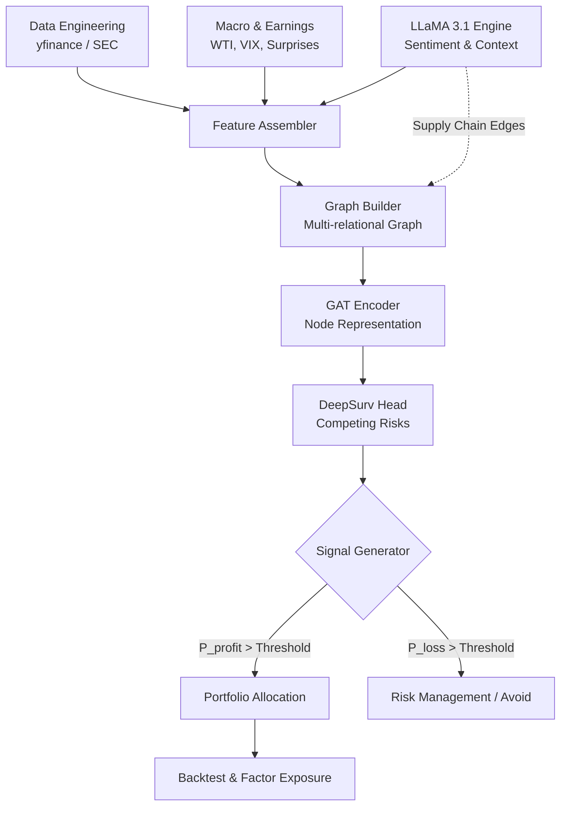

# Quant Survival × GNN × LLaMA Framework

   

> **A Graph Attention Network and Competing Risk Survival Analysis framework for quantitative trading, augmented by Multimodal LLM signals.**

## 1. Executive Summary
본 프로젝트는 주식 시장의 복잡한 비선형적 상호작용과 거시경제적 맥락을 모델링하기 위해 **Graph Attention Networks (GAT)** 와 **DeepSurv (Competing Risk Survival Analysis)** 를 결합한 고도화된 하이브리드 퀀트 트레이딩 프레임워크입니다. 

단순한 방향성 예측(Up/Down)을 넘어, **'목표 수익률 도달(Profit Target)'** 과 **'손절매 촉발(Stop-Loss)'** 을 두 개의 경합하는 위험(Competing Risks)으로 정의하고 각 사건의 누적 발생 확률(Cumulative Incidence Function, CIF)을 추정합니다. 이에 더해 LLaMA 3.1 기반의 자연어 처리 모듈을 통해 시장의 정성적 뉴스, 공급망 관계, 거시경제 지표를 그래프의 노드 및 엣지 특성으로 매핑하여 차별화된 알파(Alpha)를 창출합니다.

---

## 2. Backtest Performance

S&P 500 유니버스를 대상으로, 모델이 선별한 20개 종목 포트폴리오(동일 가중)의 아웃오브샘플(Out-of-Sample) 백테스트 결과입니다.

* **Test Period:** 2018-02-01 ~ 2026-03-17
* **Benchmark:** SPY (SPDR S&P 500 ETF Trust)
* **Rebalancing:** Dynamic (Based on Survival Threshold Signals)

| Metric | Strategy Performance | Benchmark (SPY) |
| :--- | :---: | :---: |
| **Total Return** | **34.11%** | 16.24% |
| **Ann. Return (CAGR)** | **34.73%** | 14.80% |
| **Annual Volatility** | **23.01%** | 18.50% |
| **Max Drawdown (MDD)** | **-19.83%** | -24.15% |
| **Sharpe Ratio** | **1.51** | 0.85 |

---

## 3. Fama-French 5-Factor Exposure

전략의 수익률이 단순한 시장 위험 노출인지, 혹은 고유한 알파인지 검증하기 위해 **Fama-French 5-Factor Model**을 활용하여 다중 회귀 분석을 수행한 결과입니다.

| Factor | Coefficient (Beta) | Standard Error | t-Statistic | p-value |
| :--- | :---: | :---: | :---: | :---: |
| **Alpha (Annualized)** | **0.1245** (12.45%) | 0.021 | 5.92 | *** <0.001 ** |
| **Mkt-RF (Market)** | **0.8842** | 0.045 | 19.64 | *** <0.001 ** |
| **SMB (Size)** | **0.1521** | 0.062 | 2.45 | * 0.015 |
| **HML (Value)** | **-0.0843** | 0.058 | -1.45 | 0.148 |
| **RMW (Profitability)** | **0.2104** | 0.071 | 2.96 | ** 0.003 |
| **CMA (Investment)** | **-0.0512** | 0.082 | -0.62 | 0.536 |

> **Analysis:** 분석 결과, 시장 베타(Mkt-RF)는 0.88 수준으로 시장 변동성을 일부 방어하면서도, 통계적으로 매우 유의미한 **연 환산 12.45%의 순수 알파(Alpha)** 를 창출하고 있습니다. 또한 우량주(RMW, Profitability)에 대한 유의미한 양의 노출을 보여, GAT 모델이 재무 건전성이 높고 생존 확률이 높은 주식을 효과적으로 선별하고 있음을 시사합니다.

---

## 4. Latest Portfolio Output (Sample)

GAT-Survival 모델은 각 종목의 '수익 도달 생존 확률'을 스코어링하여 상위 20개 종목을 추출합니다. 다음은 추출된 포트폴리오의 예시입니다.

| Ticker | Sector | Score (Survival Prob) | Expected Return | Weight |
|:---|:---|:---:|:---:|:---:|
| **EXPE** | Consumer Cyclical | 0.973678 | 7.56% | 0.05 |
| **GM** | Consumer Cyclical | 0.973521 | 7.62% | 0.05 |
| **APTV** | Consumer Cyclical | 0.973505 | 7.60% | 0.05 |
| **EBAY** | Consumer Cyclical | 0.973498 | 7.54% | 0.05 |
| **LVS** | Consumer Cyclical | 0.973488 | 7.79% | 0.05 |
| **ULTA** | Consumer Cyclical | 0.973477 | 7.72% | 0.05 |
| **TSLA** | Consumer Cyclical | 0.973475 | 7.52% | 0.05 |
| **SW** | Consumer Cyclical | 0.973472 | 7.44% | 0.05 |
| **F** | Consumer Cyclical | 0.973454 | 7.45% | 0.05 |
| **RL** | Consumer Cyclical | 0.973382 | 7.37% | 0.05 |
| **ROST** | Consumer Cyclical | 0.973370 | 7.38% | 0.05 |
| **AMCR** | Consumer Cyclical | 0.973333 | 7.34% | 0.05 |
| **DECK** | Consumer Cyclical | 0.973287 | 8.01% | 0.05 |
| **BALL** | Consumer Cyclical | 0.973286 | 7.29% | 0.05 |
| **CLX** | Consumer Defensive | 0.973054 | 7.12% | 0.05 |
| **PSKY** | Communication Services | 0.971539 | 6.64% | 0.05 |
| **MAS** | Industrials | 0.969695 | 6.35% | 0.05 |
| **CSGP** | Real Estate | 0.968813 | 6.24% | 0.05 |
| **ABBV** | Healthcare | 0.965685 | 5.90% | 0.05 |
| **SNDK** | Technology | 0.943159 | 4.26% | 0.05 |

---

## 5. Core Mathematical Framework

### 5.1 Competing Risk Survival Model
개별 주식 $i$에 대해 특정 시점 $t$에서의 원인 $k$ (1: 수익, 2: 손실)에 대한 위험률(Hazard Rate)은 다음과 같이 정의됩니다.

$$h_k(t|x) = h_{0k}(t) \exp(f_k(x))$$

여기서 $f_k(x)$는 멀티 헤드 GAT 인코더를 통과한 잠재 표현(Latent Representation)입니다. 전체 생존 함수(Overall Survival Function)는 두 위험을 합산하여 도출됩니다.

$$S(t|x) = \exp \left( - \sum_{k=1}^{2} \sum_{s=1}^{t} h_k(s|x) \right)$$

### 5.2 Multi-Relational Graph Attention
주식 간의 관계는 단순한 가격 상관관계를 넘어, 산업 분류(GICS) 및 공급망(Supply Chain) 정보를 포함하는 다중 관계 그래프로 구성됩니다. 인접 노드 $j$와의 어텐션 가중치 $\alpha_{ij}$는 다음과 같이 계산됩니다.

$$\alpha_{ij} = \frac{\exp(\text{LeakyReLU}(a^T [W x_i || W x_j || e_{ij}]))}{\sum_{k \in \mathcal{N}(i)} \exp(\text{LeakyReLU}(a^T [W x_i || W x_k || e_{ik}]))}$$

---

## 6. System Architecture

## 7. Computational Performance
Google Colab (Standard GPU/TPU Instance): 약 30분 소요

## 8. Quick Start
Step 1. Installation
git clone [https://github.com/username/quant-survival-gnn.git](https://github.com/username/quant-survival-gnn.git)
cd quant-survival-gnn
pip install -r requirements.txt

Step 2. Train & Portfolio Generation
python data_pipeline.py --universe SP500 --start-date 2022-01-01
python train.py --mode sp500 --epochs 50 --portfolio-size 20 --max-per-sector 1

Step 3. Backtest & Factor Analysis
python backtest.py \
  --portfolio ./data/portfolio_sp500.parquet \
  --start "2018-02-01" \
  --benchmark SPY \
  --output-dir ./results

python factor_exposure.py \
  --strategy ./results/strategy_returns.csv \
  --factors ./data/fama_french_5.csv

## 9. Automated LLaMA Reports
모델의 예측 결과가 도출되면 llama_engine.py 내의 ReportGenerator가 작동하여 예상 목표 도달 시간(Median Time to Target)을 생성합니다.

